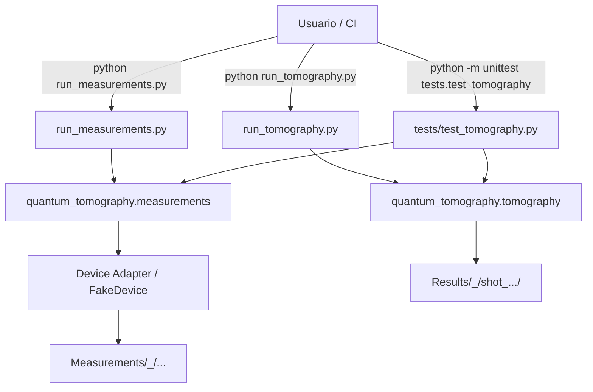

Repositorio
Creado para tomografía en Braket

Authors:
- Giannina Zerr (https://github.com/gianninazerr)  
- Federico Holik
- Marcelo Losada (https://github.com/MarceLosada)

This project is part of the work "Group-invariant estimation of symmetric states generated by noisy quantum computers".
    - https://arxiv.org/abs/2408.09183

Jun 13 --> Forked by José
Para pruebas de migración Braket --> SpinQ

**Nuevo flujo modularizado**

Se reorganizó el proyecto en módulos y se añadió un flujo reproducible:

- Crear un entorno virtual e instalar dependencias:

    ```bash
    python scripts/setup_env.py
    ```

- Copiar y editar `.env.template` a `.env` para configurar entradas (estado, shots, etc.).

- Ejecutar simulación de mediciones (genera `Measurements/`):

    ```bash
    python run_measurements.py
    ```

- Ejecutar tomografía (consume `Measurements/` y escribe `Results/`):

    ```bash
    python run_tomography.py
    ```

- Ejecutar todo (mediciones → tomografía → tests):

    ```bash
    python run_all.py
    ```

Tests
-----

Se incluye una prueba de integración que simula mediciones sin ruido y verifica
que la reconstrucción de la densidad obtiene alta fidelidad:

```bash
python -m unittest discover -v
```

Estructura principal añadida
- `quantum_tomography/measurements.py` — simulador independiente del backend
- `quantum_tomography/tomography.py` — reconstructor modular (LS + PSD)
- `quantum_tomography/backend.py` — abstracción mínima de dispositivos
- `tests/test_tomography.py` — prueba de integración post-tomografía
- `.env.template`, `requirements.txt`, `scripts/setup_env.py`

Esta reestructuración separa la lógica de negocio (tomografía y mediciones)
de las dependencias del dispositivo/simulador, facilita testing automatizado
y permite ejecutar el flujo completo con scripts simples.

**Ejecución (Actualizado)**

Sigue estos pasos desde la raíz del repositorio.

- 1) Crear entorno virtual e instalar dependencias (intenta la instalación completa; el instalador hará fallback a las dependencias core si hay problemas con paquetes compilados):

```bash
python scripts/setup_env.py
```

- 2) Copiar la plantilla de configuración y editar valores en `.env`:

```bash
cp .env.template .env    # Windows cmd: copy .env.template .env
# Ajusta STATE_TYPE, N, S, SHOTS, etc. según tu experimento
```

- 3) Ejecutar mediciones (genera `Measurements/<state>_<symmetry>/...`):

```bash
python run_measurements.py
```

- 4) Ejecutar tomografía (creará un subdirectorio con timestamp dentro de `Results/<state>_<symmetry>/`):

```bash
python run_tomography.py
# El script imprimirá la ruta exacta del subdirectorio timestamped
```

Nota sobre la estructura de `Results`:

- Cada ejecución crea una carpeta con prefijo `shot_DD_MM_YY_HH_MM_SS` dentro de `Results/<state>_<symmetry>/` para trazabilidad. Ejemplo:

[Results structure example](Results/)

- El diseño garantiza que las ejecuciones previas con timestamp se conservan y que cualquier estructura "plana" heredada bajo `Results/<state>_<symmetry>/` es eliminada automáticamente antes de crear la carpeta timestamp de la nueva ejecución.

Visualizar archivos `.npy` en VS Code
-----------------------------------

Recomiendo usar la extensión `vscode-numpy-viewer` para previsualizar `.npy`/`.npz` dentro de VS Code.

Instálala desde la paleta de extensiones o usando la interfaz de VS Code.

Comandos rápidos para inspeccionar manualmente (sin VS Code):

```bash
python - <<'PY'
import numpy as np
a = np.load('Results/<state>_<symmetry>/shot_.../AmplitudeDamping/DMtomo_noise0_shots100.npy', allow_pickle=True)
print(type(a), getattr(a,'shape',None))
PY
```

Diagrama de componentes
-----------------------

El flujo principal (medición → tomografía → resultados → tests) está documentado en `docs/flow.md` y a continuación:



Soporte y notas
---------------

- Si necesitas `qutip` o `cvxpy` en Windows, usa `conda` para evitar problemas con ruedas binarias.
- `.gitignore` ya excluye `.venv`, `.env`, `Measurements/` y `Results/`.

Si quieres, puedo además generar `docs/USAGE.md` con ejemplos extendidos y capturas de salida. ¿Lo quieres?