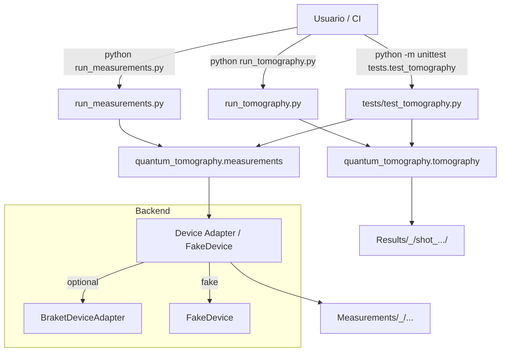

# Diagrama de flujo — ejecución de pruebas

Este archivo describe el diagrama de componentes que se invocan durante una corrida de prueba (mediciones + tomografía + tests).

```mermaid
flowchart TD
  U[Usuario / CI] --> |"python run_measurements.py"| RM[run_measurements.py]
  RM --> MQ[quantum_tomography.measurements]
  MQ --> DA[Device Adapter / FakeDevice]
  DA --> MF[Measurements/<state>_<symmetry>/...]
  U --> |"python run_tomography.py"| RT[run_tomography.py]
  RT --> TQ[quantum_tomography.tomography]
  TQ --> RF[Results/<state>_<symmetry>/shot_.../]
  U --> |"python -m unittest tests.test_tomography"| TEST[tests/test_tomography.py]
  TEST --> TQ
  TEST --> MQ

  subgraph Backend
    DA --> |optional| Braket[BraketDeviceAdapter]
    DA --> |fake| Fake[FakeDevice]
  end
```
